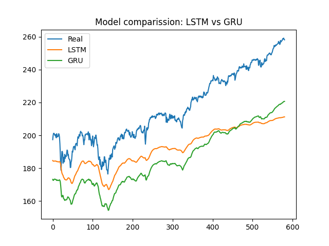

# Deep Learning Time Series Forecasting

Forecasting S&P 500 closing prices using **LSTM** and **GRU** neural networks.

## Tech Stack

- Python
- TensorFlow / Keras
- NumPy
- Pandas
- Scikit-learn
- Matplotlib

## Models

- LSTM (64 → 32 units)
- GRU (64 → 32 units)
- Batch Normalization
- Dropout (0.2)
- Adam Optimizer

## Data Pipeline

- S&P 500 historical data
- 80/20 train-test split
- MinMax scaling
- Sequence length: 60

## Results



Predictions are evaluated using **RMSE**.

## Installation

```bash
git clone https://github.com/yourusername/DeepLearningTimeSeriesForecasting.git
cd DeepLearningTimeSeriesForecasting

python -m venv .venv
source .venv/bin/activate   # Linux/macOS
# or
.venv\Scripts\activate      # Windows

pip install -r requirements.txt
```

## Run

```bash
cd src
python stock_price_forecasting.py
```

## Requirements

```text
numpy==1.23.5
pandas==1.5.3
matplotlib==3.7.1
scikit-learn==1.2.2
seaborn==0.13.2
tensorflow==2.15.1
keras==2.15.0
shap==0.47.2
```
